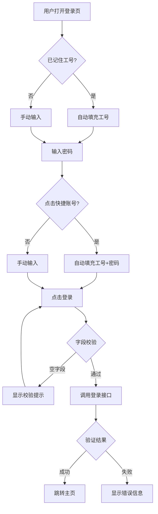

## 1. 产品概述

试剂库管理系统的前端登录页面，为四层分级权限系统（超级管理员/管理员/教师/学生）提供工号+密码认证入口。目标是替代当前 Streamlit 内置登录，打造一个视觉冲击力强、符合实验室科学仪器风格的专业登录界面。

- 目标用户：实验室管理员、教师、学生等所有需要访问试剂库管理系统的用户
- 核心价值：提供安全、直观、具有品牌识别度的系统入口，传达"精密科研"的产品调性

## 2. 核心功能

### 2.1 用户角色

| 角色 | 登录方式 | 核心权限 |
|------|----------|----------|
| 超级管理员 | 工号 root / 密码 admin123 | 系统数据维护、用户管理 |
| 管理员 | 工号 / 密码 | 试剂瓶管理+审批 |
| 教师 | 工号 / 密码 | 借出试剂 |
| 学生 | 默认未登录 | 仅查看 |

### 2.2 功能模块

1. **登录页面**：工号密码输入、记住工号、登录验证、错误提示、测试账号快捷填充

### 2.3 页面详情

| 页面名称 | 模块名称 | 功能描述 |
|----------|----------|----------|
| 登录页面 | 品牌标识区 | 系统名称+Logo+副标题，分子结构装饰动画 |
| 登录页面 | 登录表单区 | 工号输入、密码输入（可切换显示）、记住工号、登录按钮 |
| 登录页面 | 快捷账号区 | 测试账号一键填充按钮（7个角色账号） |
| 登录页面 | 状态反馈 | 加载状态、登录成功/失败提示、空字段校验 |

## 3. 核心流程

用户打开登录页面 → 输入工号和密码（或点击快捷账号自动填充）→ 点击登录 → 前端校验非空 → 调用后端登录接口验证 → 成功跳转主页 / 失败显示错误提示

## 4. 用户界面设计

### 4.1 设计风格

- **主题**：深色科研仪器风 — 深邃暗色背景 + 青色/蓝绿霓虹辉光，模拟实验室仪器面板
- **主色调**：深邃近黑背景 `#0a0e1a` + 青色辉光 `#00d4ff` / 蓝绿 `#14b8a6`
- **辅助色**：暖橙 `#f59e0b`（用于警告/错误），柔白 `#e2e8f0`（文字）
- **按钮风格**：渐变填充 + 内发光，hover 时辉光增强
- **字体**：标题用 `Orbitron`（科技感几何字体），正文用 `JetBrains Mono`（等宽编程风）
- **布局**：居中卡片式，左侧分子结构动画装饰 + 右侧登录表单
- **图标风格**：线性图标（lucide-react），细描边，与科技感统一
- **动效**：分子结构旋转/浮动动画、输入框聚焦时辉光扩散、按钮加载波纹、背景粒子缓慢漂移

### 4.2 页面设计概述

| 页面名称 | 模块名称 | UI 元素 |
|----------|----------|--------|
| 登录页面 | 背景层 | 深色渐变背景 + 分子结构SVG动画 + 浮动粒子 |
| 登录页面 | 左侧品牌区 | 系统Logo（试管/分子图标）+ 系统名称 + 副标题 + 装饰性分子链 |
| 登录页面 | 右侧表单区 | 工号输入(带图标) + 密码输入(带显示切换) + 记住工号 + 登录按钮(渐变发光) |
| 登录页面 | 快捷账号条 | 7个角色标签按钮，hover 显示密码，点击填充 |
| 登录页面 | 状态提示 | 成功(绿色toast) / 失败(红色toast) / 加载(旋转图标) |

### 4.3 响应式

- 桌面优先设计（宽屏左右分栏）
- 平板：品牌区缩小，表单区保持宽度
- 移动端：品牌区隐藏或缩为顶部Logo，表单全宽居中

## 5. 技术约束

- 纯前端实现，登录验证使用本地 mock（模拟后端接口）
- 预置测试账号数据（与 permission_demo 种子数据一致）
- 登录成功后显示欢迎信息（模拟跳转，不实际跳转页面）
- 使用 React + TypeScript + Vite + Tailwind CSS
- 使用 lucide-react 图标库
- 使用 motion 库实现动画
