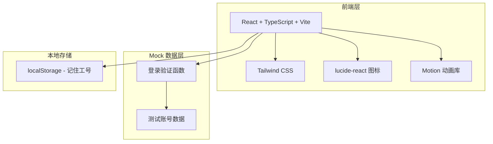

## 1. 架构设计



## 2. 技术说明

- **前端框架**: React@18 + TypeScript + Vite
- **样式方案**: Tailwind CSS@3
- **图标库**: lucide-react
- **动画库**: motion（Framer Motion）
- **初始化工具**: vite-init
- **后端**: 无（纯前端 mock 验证）
- **数据**: 硬编码测试账号（与 permission_demo 种子数据一致）

## 3. 路由定义

| 路由 | 用途 |
|------|------|
| / | 登录页面（唯一页面） |

## 4. Mock 登录接口

```typescript
// 测试账号数据
interface TestAccount {
  work_id: string;
  password: string;
  role: 'super_admin' | 'admin' | 'teacher' | 'student';
  display_name: string;
  department: string;
}

const TEST_ACCOUNTS: TestAccount[] = [
  { work_id: 'root',  password: 'admin123', role: 'super_admin', display_name: '系统管理员', department: '系统管理部' },
  { work_id: 'zhang', password: '123456',   role: 'admin',       display_name: '张管理',     department: '化学实验室' },
  { work_id: 'li',    password: '123456',   role: 'admin',       display_name: '李管理',     department: '生物实验室' },
  { work_id: 'wang',  password: '123456',   role: 'teacher',     display_name: '王教授',     department: '化学系' },
  { work_id: 'zhao',  password: '123456',   role: 'teacher',     display_name: '赵教授',     department: '生物系' },
  { work_id: 'stu1',  password: '123456',   role: 'student',     display_name: '小学生',     department: '化学系' },
  { work_id: 'stu2',  password: '123456',   role: 'student',     display_name: '中学生',     department: '生物系' },
];

// 模拟登录验证
function mockLogin(work_id: string, password: string): Promise<{ success: boolean; user?: TestAccount; message?: string }>
```

## 5. 组件结构

```
src/
├── pages/
│   └── LoginPage.tsx          # 登录页面主组件
├── components/
│   ├── MolecularBackground.tsx # 分子结构背景动画
│   ├── LoginForm.tsx          # 登录表单
│   ├── QuickAccounts.tsx      # 快捷账号选择条
│   ├── RoleBadge.tsx          # 角色标签徽章
│   └── Toast.tsx              # 状态提示组件
├── data/
│   └── accounts.ts            # 测试账号数据 + mock登录函数
├── App.tsx
└── main.tsx
```

## 6. 设计令牌

```css
/* CSS 变量 */
--bg-primary: #0a0e1a        /* 深邃背景 */
--bg-card: rgba(15,23,42,0.6) /* 半透明卡片 */
--accent-cyan: #00d4ff       /* 主青色辉光 */
--accent-teal: #14b8a6       /* 蓝绿辅助 */
--accent-amber: #f59e0b      /* 警告橙 */
--text-primary: #e2e8f0      /* 主文字 */
--text-muted: #64748b        /* 次要文字 */
--border-glow: rgba(0,212,255,0.2) /* 辉光边框 */
```
